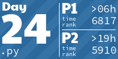

<!-- AOC TILES BEGIN -->
<h1 align="center">
  Advent of Code - 224/468 ⭐
</h1>
<h1 align="center">
  2024 - 10 ⭐ - Python
</h1>

<h1 align="center">
  2023 - 50 ⭐ - Python
</h1>

<h1 align="center">
  2022 - 44 ⭐ - Python
</h1>

<h1 align="center">
  2021 - 50 ⭐ - Python
</h1>

<h1 align="center">
  2017 - 38 ⭐ - Python
</h1>

<h1 align="center">
  2015 - 32 ⭐ - Python
</h1>

<!-- AOC TILES END -->
